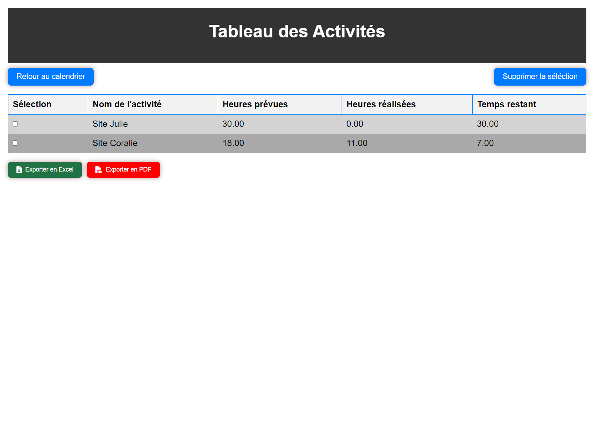
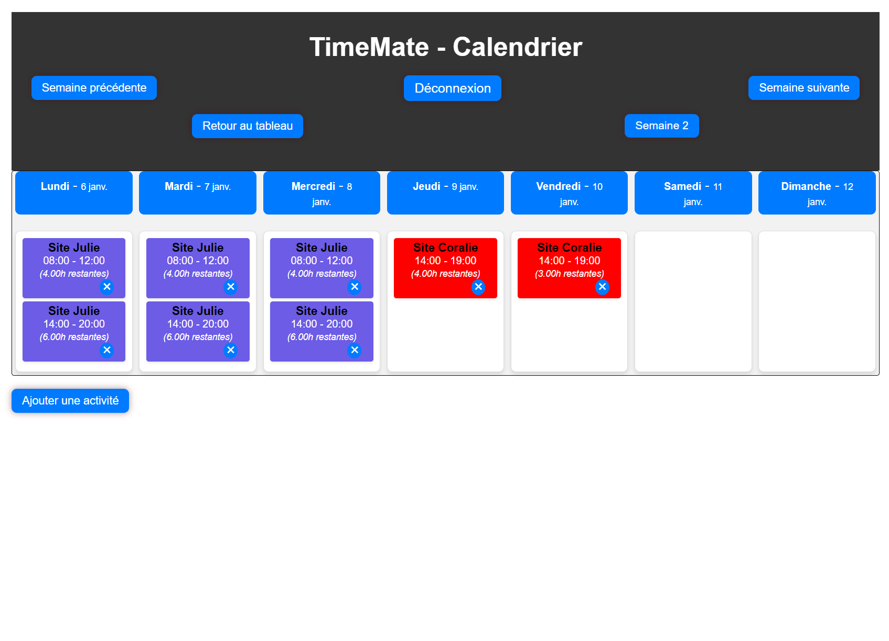

# TimeMate - Gestionnaire de Temps et d'Activités

## Description
TimeMate est une application web permettant de gérer et suivre le temps passé sur différentes activités. Elle offre une interface intuitive pour planifier, suivre et analyser le temps consacré à diverses tâches.

## Fonctionnalités
- 🔐 Authentification sécurisée avec Firebase
- 📅 Calendrier hebdomadaire interactif
- ⏱️ Gestion des plages horaires multiples
- 📊 Suivi du temps prévu vs réalisé
- 📈 Tableau récapitulatif des activités
- 📤 Export des données (Excel, PDF)
- 🎨 Personnalisation des couleurs par activité

## Installation

1. Clonez le repository
bash
git clone https://github.com/JavaChrist/TimeMate-V5.git
cd timemate

2. Configuration Firebase
- Copiez `firebase-config.example.js` vers `firebase-config.js`
- Créez un projet dans [Firebase Console](https://console.firebase.google.com/)
- Remplacez les valeurs dans `firebase-config.js` avec vos informations Firebase :

javascript
const firebaseConfig = {
apiKey: "VOTRE_API_KEY",
authDomain: "VOTRE_AUTH_DOMAIN",
projectId: "VOTRE_PROJECT_ID",
storageBucket: "VOTRE_STORAGE_BUCKET",
messagingSenderId: "VOTRE_MESSAGING_SENDER_ID",
appId: "VOTRE_APP_ID"
};

## Structure du Projet

timemate/
├── index.html # Page de connexion
├── app.html # Application principale (calendrier)
├── activites.html # Tableau des activités
├── assets/
│ ├── images/ # Images et icônes
│ └── js/ # Scripts JavaScript
├── main.css # Styles principaux
└── login.css # Styles de la page de connexion

## Technologies Utilisées
- HTML5, CSS3, JavaScript
- Firebase (Authentication)
- Flatpickr (Sélecteur de dates)
- SheetJS (Export Excel)
- html2canvas & jsPDF (Export PDF)
- Font Awesome (Icônes)

## Fonctionnalités Détaillées

### Gestion des Activités
- Création d'activités avec plages horaires multiples
- Suivi du temps passé
- Suppression d'activités
- Modification des temps réalisés

### Calendrier
- Vue hebdomadaire
- Navigation entre les semaines
- Affichage visuel des activités
- Gestion des chevauchements

### Tableau de Bord
- Vue d'ensemble des activités
- Calcul automatique des heures restantes
- Export des données
- Filtrage et sélection multiple

## Sécurité
- Authentification utilisateur
- Protection des routes
- Gestion des sessions
- Déconnexion sécurisée

## Contribution
1. Fork le projet
2. Créez votre branche (`git checkout -b feature/AmazingFeature`)
3. Committez vos changements (`git commit -m 'Add some AmazingFeature'`)
4. Push vers la branche (`git push origin feature/AmazingFeature`)
5. Ouvrez une Pull Request

## License
Ce projet est sous licence MIT. Voir le fichier `LICENSE` pour plus de détails.

## Contact
Votre Nom - [@javachrist](https://twitter.com/javachrist)
Lien du projet: [https://github.com/JavaChrist/TimeMate-V5.git]

